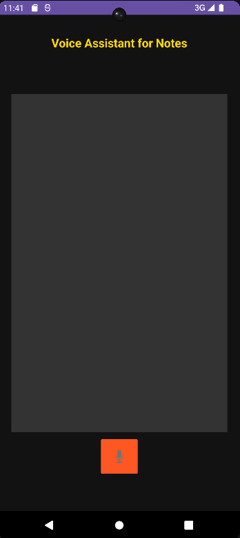
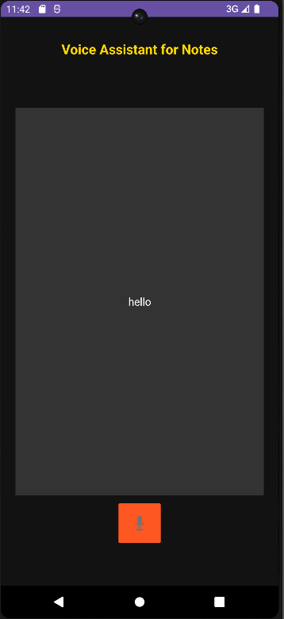

# Voice to Note App

Voice to Note App is an Android application designed to convert voice input into text notes, facilitating hands-free note-taking for visually impaired users.

## Features

- **Voice Recording:** Capture voice notes seamlessly.
- **Transcription:** Convert voice recordings into text.
- **Playback:** Listen to your recorded notes.
- **Note Management:** Save, edit, and delete notes easily.
- **User-Friendly Interface:** Simple and intuitive design for easy navigation.

## Installation

1. **Clone the Repository:**
   ```sh
   git clone https://github.com/rupeshkumar18123/voice_to_note_app.git
   ```
2. **Navigate to the Project Directory:**
   ```sh
   cd voice_to_note_app
   ```
3. **Open in Android Studio:**
    - Launch Android Studio.
    - Select 'Open an existing project' and choose the `voice_to_note_app` directory.
4. **Build the Project:**
    - Allow Android Studio to synchronize and build the project.
5. **Run the Application:**
    - Connect an Android device or start an emulator.
    - Click the 'Run' button in Android Studio.

## Screenshots

### Home Screen




## Technologies Used

- **Java:** Core programming language for Android development.
- **Android Studio:** Integrated Development Environment (IDE) for building Android apps.
- **Google Cloud Speech-to-Text API:** Converts audio to text.
- **SQLite:** Local database for storing notes.

## Usage

1. Open the app and allow microphone permissions.
2. Tap the microphone button to start recording.
3. Speak your note, and it will be transcribed to text.
4. Save or delete notes as needed.
5. View, edit, or play back saved notes.

## Contributing

We welcome contributions! To contribute:

1. Fork the repository.
2. Create a new branch (`git checkout -b feature-branch`).
3. Make your changes and commit (`git commit -m "Added a new feature"`).
4. Push to the branch (`git push origin feature-branch`).
5. Open a Pull Request.

## License

This project is licensed under the MIT License. See the `LICENSE` file for details.
